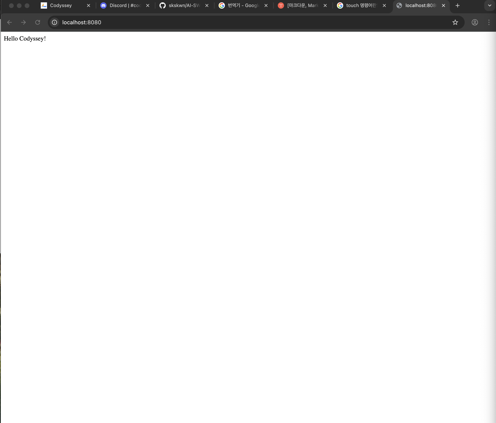

#  1. AI/SW 개발 워크스테이션 구축

## 1. 프로젝트 개요
- **목표:** 리눅스 CLI, Docker, Git을 활용하여 재현 가능하고 독립적인 로컬 개발 환경(워크스테이션)을 구축하고, 그 원리와 동작을 검증합니다.

- **주요 내용:** 시스템 보안 정책(sudo 제한)을 고려하여 OrbStack을 활용한 Docker 컨테이너 환경 구성, CLI를 통한 파일/권한 제어, Dockerfile을 이용한 Nginx 커스텀 웹 서버 빌드, 포트 매핑 및 볼륨을 통한 데이터 영속성 확인, Git/GitHub 버전 관리 연동.

---

## 2. 실행 환경
- **OS:** [예: macOS Sonoma 14.4 / Windows 11 WSL2 Ubuntu 22.04]
- **Shell / Terminal:** [예: zsh / bash]
- **Docker 버전:** [예: Docker version 26.0.0, build 2ae903e] (OrbStack 기반)
- **Git 버전:** [예: git version 2.39.3 (Apple Git-146)]

---

## 3. 수행 항목 체크리스트
- [O] 터미널 기본 조작 및 폴더 구성 
- [O] 권한 변경 실습 및 증거 기록 
- [O] Docker 설치 및 기본 데몬 점검 
- [x] Dockerfile 기반 커스텀 이미지 빌드 및 실행 
- [x] 포트 매핑을 통한 브라우저 접속 증명 
- [x] Docker 볼륨 생성 및 영속성 검증 
- [x] Git 사용자 설정 및 GitHub 연동 
- [x] 트러블슈팅 2건 이상 작성 

---

## 4. 상세 수행 로그 및 검증 결과

### 4.1 터미널 조작 및 권한 실습
**[검증 방법]** `mkdir`, `touch`로 디렉토리와 파일을 생성하고, `chmod`를 이용해 권한을 변경한 뒤 `ls -la`로 전/후 상태를 확인했습니다.

```bash
# 1. 파일 및 폴더 생성 로그
$mkdir -p ~/codyssey-workspace
$ cd ~/codyssey-workspace
$ pwd
/Users/username/codyssey-workspace

$ touch test.txt


# 2. 권한 변경 전/후 비교 로그

# 권한 변경 전
$ ls -la test.txt
-rw-r--r--  1 user  staff  0  4 10 10:00 test.txt

$chmod 777 test.txt #(777 : 모든 사용자 읽기/쓰기/실행)

# 권한 변경 후
$ ls -la test.txt
-rwxrwxrwx  1 user  staff  0  4 10 10:01 test.txt
```

### 4.2 Docker 기본 점검 (OrbStack)
서울캠퍼스 환경에서는 시스템 보안 정책상 sudo 권한 사용이 제한될 수 있습니다.

이로 인해 일반적인 방식으로 Docker를 직접 설치하거나 데몬을 제어하는 데 제약이 있습니다.

이 문제를 해결하기 위해, 본 과정에서는 OrbStack을 활용합니다.


**[검증 방법]** docker --version과 docker info 명령을 통해 OrbStack 기반의 데몬이 정상 작동하는지 확인했습니다.

```bash
$ docker --version
Docker version 28.5.2, build ecc6942

$ docker info
Client:
 Version:    28.5.2
 Context:    orbstack
 Debug Mode: false
 Plugins:
  buildx: Docker Buildx (Docker Inc.)
    Version:  v0.29.1
    Path:     /Users/good0766sjmsss0766/.docker/cli-plugins/docker-buildx
  compose: Docker Compose (Docker Inc.)
    Version:  v2.40.3
    Path:     /Users/good0766sjmsss0766/.docker/cli-plugins/docker-compose
```

### 4.3 커스텀 이미지 제작 (Dockerfile)

**[검증 방법]** Nginx Alpine 베이스 이미지를 활용하여, 기본 웹 페이지 대신 직접 작성한 index.html이 출력되도록 커스텀 이미지를 빌드했습니다.

선택한 방식: (A) 웹 서버 베이스 이미지 활용

상세 내용: > "순수 OS 이미지에서 웹 서버를 직접 설치하는 대신, 이미 최적화된 웹 서버 환경을 제공하는 nginx:alpine 이미지를 베이스로 선택했습니다. COPY 명령을 통해 정적 콘텐츠(index.html)만 교체하는 효율적인 커스텀 방식을 적용했습니다."

Nginx Alpine 베이스 이미지를 사용한 이유?

1. 초경량 사이즈

    일반적인 nginx 이미지는 Debian 같은 완전한 OS 환경을 포함하고 있어 용량이 수백 MB에 달합니다. 반면, Alpine Linux는 오직 실행에 필요한 최소한의 바이너리만 포함하고 있어 전체 이미지 크기가 보통 20~30MB 내외입니다.

2. 자원 효율성
    
    메모리와 CPU 사용량이 매우 적습니다. 이번 미션처럼 간단한 정적 웹 페이지를 띄우는 용도에는 무거운 OS 환경이 전혀 필요 없기 때문에 Alpine 버전이 가장 효율적입니다.

위 2가지 조건을 고려했을 때 현재 미션에 가장 적합한 이미지라는 사실을 확인하여 적용하게 되었습니다.

작성한 Dockerfile:
```bash
FROM nginx:alpine

COPY index.html /codyssey-workspace/index.html
```

빌드 및 결과 로그:

```bash
$ docker build -t my-custom-web:1.0 . # 이미지 빌드 (이름은 my-custom-web, 버전은 1.0)

 .
[+] Building 7.2s (7/7) FINISHED                                docker:orbstack
 => [internal] load build definition from Dockerfile                       0.1s
 => => transferring dockerfile: 102B                                       0.0s
 => [internal] load metadata for docker.io/library/nginx:alpine            2.7s
 => [internal] load .dockerignore                                          0.2s
 => => transferring context: 2B                                            0.0s
 => [internal] load build context                                          0.2s
 => => transferring context: 49B                                           0.0s
 => [1/2] FROM docker.io/library/nginx:alpine@sha256:e7257f1ef28ba17cf7c2  3.5s
 => => resolve docker.io/library/nginx:alpine@sha256:e7257f1ef28ba17cf7c2  0.2s
 => => sha256:7e89aa6cabfc80f566b1b77b981f4bb98413bd2d513 2.50kB / 2.50kB  0.0s
 => => sha256:d5030d429039a823bef4164df2fad7a0defb8d00c 12.32kB / 12.32kB  0.0s
 => => sha256:e7257f1ef28ba17cf7c248cb8ccf6f0c6e0228ab9 10.33kB / 10.33kB  0.0s
 => => sha256:589002ba0eaed121a1dbf42f6648f29e5be55d5c8a6 3.86MB / 3.86MB  0.5s
 => => sha256:8892f80f46a05d59a4cde3bcbb1dd26ed2441d42148 1.87MB / 1.87MB  0.8s
 => => sha256:91d1c9c22f2c631288354fadb2decc448ce151d7a197c16 626B / 626B  0.9s
 => => extracting sha256:589002ba0eaed121a1dbf42f6648f29e5be55d5c8a6ee0f8  0.1s
 => => sha256:cf1159c696ee2a72b85634360dbada071db61bceaad253d 953B / 953B  1.0s
 => => extracting sha256:8892f80f46a05d59a4cde3bcbb1dd26ed2441d4214870a4a  0.1s
 => => sha256:3f4ad4352d4f91018e2b4910b9db24c08e70192c3b75d0d 402B / 402B  1.3s
 => => sha256:c2bd5ab177271dd59f19a46c214b1327f5c428cd075 1.21kB / 1.21kB  1.3s
 => => extracting sha256:91d1c9c22f2c631288354fadb2decc448ce151d7a197c167  0.0s
 => => extracting sha256:cf1159c696ee2a72b85634360dbada071db61bceaad253db  0.0s
 => => sha256:4d9d41f3822d171ccc5f2cdfd75ad846ac4c7ed1cd3 1.40kB / 1.40kB  1.6s
 => => extracting sha256:3f4ad4352d4f91018e2b4910b9db24c08e70192c3b75d0d6  0.0s
 => => sha256:3370263bc02adcf5c4f51831d2bf1d54dbf9a6a80 20.25MB / 20.25MB  2.0s
 => => extracting sha256:c2bd5ab177271dd59f19a46c214b1327f5c428cd075437ec  0.0s
 => => extracting sha256:4d9d41f3822d171ccc5f2cdfd75ad846ac4c7ed1cd36fb99  0.0s
 => => extracting sha256:3370263bc02adcf5c4f51831d2bf1d54dbf9a6a80b0bf32c  0.4s
 => [2/2] COPY index.html /codyssey-workspace/index.html                   0.2s
 => exporting to image                                                     0.2s
 => => exporting layers                                                    0.1s
 => => writing image sha256:207a27a99f7f82109eb2769c7b7c31d902ec32bb32052  0.0s
 => => naming to docker.io/library/my-custom-web:1.0                       0.0s

 $ docker images

REPOSITORY      TAG       IMAGE ID       CREATED          SIZE
my-custom-web   1.0       207a27a99f7f   16 minutes ago   62.2MB


```

### 4.4 포트 매핑 및 접속 증거

**[검증 방법]** 호스트의 8080 포트를 컨테이너의 80 포트(Nginx 기본 포트)와 연결하여 실행한 후 접속을 확인했습니다.

```bash
$ docker run -d -p 8080:80 --name my-web-8080 my-custom-web:1.0 
# -d 데몬모드, -p 포트매핑, --name: 컨테이너 이름

$ docker ps
CONTAINER ID   IMAGE               COMMAND                  CREATED         STATUS         PORTS                                     NAMES
adf32842487c   my-custom-web:1.0   "/docker-entrypoint.…"   6 minutes ago   Up 6 minutes   0.0.0.0:8080->80/tcp, [::]:8080->80/tcp   my-web-8080
```




### 4.5 볼륨 영속성 검증

**[검증 방법]** Docker 볼륨과 바인드 마운트 생성해 컨테이너에 마운트하고 텍스트 파일을 생성한 뒤, 컨테이너를 강제 삭제하고 새 컨테이너를 띄워도 기존 데이터가 유지되는지 확인했습니다.

#### Docker 볼륨 (Docker Volume) 실습

1단계: 데이터를 담을 볼륨 만들기
제일 먼저, 컨테이너와 별개로 존재할 저장 공간(볼륨)을 만들어야 합니다.
```bash
# 1. 'codyssey-storage'라는 이름의 Docker 볼륨 생성
$ docker volume create codyssey-storage
```

2단계: 첫 번째 컨테이너에 볼륨 연결하고 '데이터' 넣기

```bash
# 1. 볼륨을 연결하여 컨테이너 실행
$ docker run -d --name codyssey-web-1 -v codyssey-storage:/usr/share/nginx/html my-custom-web:1.0

# 2. 데이터 쓰기
$ docker exec codyssey-web-1 sh -c 'echo "<h1>Codyssey Mission Success!</h1>" > /usr/share/nginx/html/index.html'
# -c 뒤 따라오는 명령어 실행

# 3. 데이터가 잘 들어갔는지 확인
$ docker exec codyssey-web-1 cat /usr/share/nginx/html/index.html # cat 연결

<h1>Codyssey Mission Success!</h1>
```

3단계: 컨테이너 삭제하고 새 컨테이너로 데이터 확인하기
```bash
# 1. 첫 번째 컨테이너 강제 삭제
$ docker rm -f codyssey-web-1

# 2. 삭제 확인 (목록에 없어야 함)
$ docker ps -a

CONTAINER ID   IMAGE               COMMAND                  CREATED          STATUS          PORTS                                     NAMES
adf32842487c   my-custom-web:1.1   "/docker-entrypoint.…"   50 minutes ago   Up 50 minutes   0.0.0.0:8080->80/tcp, [::]:8080->80/tcp   my-web-8080


# 3. 두 번째 새로운 컨테이너(container-2)를 만들어서 '같은 데이터' 연결하기
$ docker run -d --name codyssey-web-2 -v codyssey-storage:/usr/share/nginx/html my-custom-web:1.0
# -v 전에 데이터와 연결

# 4. 목록 확인
$ docker ps -a

CONTAINER ID   IMAGE               COMMAND                  CREATED          STATUS          PORTS                                     NAMES
30d297ee76e7   my-custom-web:1.0   "/docker-entrypoint.…"   21 seconds ago   Up 20 seconds   80/tcp                                    codyssey-web-2
adf32842487c   my-custom-web:1.1   "/docker-entrypoint.…"   52 minutes ago   Up 52 minutes   0.0.0.0:8080->80/tcp, [::]:8080->80/tcp   my-web-8080

# 5. 새 컨테이너에서 아까 그 데이터 읽어보기
$ docker exec codyssey-web-2 cat /usr/share/nginx/html/index.html # cat 연결

<h1>Codyssey Mission Success!</h1>
```

도커 볼륨 생성 성공 하였으며 컨테이너 삭제 후에도 데이터 영속성 유지가 되었음을 확인하였습니다.

#### 바인드 마운트 (Bind Mount) 실습

1단계: 호스트에 실습 폴더와 파일 준비
```bash
# 1. 실습용 폴더 생성
$ mkdir -p ~/codyssey/host-data

# 2. 초기 파일 생성 (변경 전 상태)
$ echo '<h1>Before Change: Original File</h1>' > ~/codyssey/html-mount/index.html

# 3. 호스트 폴더 내용 확인
$ ls -l ~/codyssey/html-mount

<h1>Before Change: Original File</h1>
```

2단계: 바인드 마운트로 컨테이너 실행

```bash
$ docker run -d --name codyssey-web-mount \
  -p 8081:80 \
  -v ~/codyssey/html-mount:/usr/share/nginx/html \
  my-custom-web:1.0
```

3단계: 실시간 동기화 검증 (대조 확인)

```bash
$ docker exec codyssey-web-mount cat /usr/share/nginx/html/index.html
# 결과: <h1>Before Change: Original File</h1>

# 호스트 터미널에서 입력
$ echo '<h1>After Change: Real-time Sync Success!</h1>' > ~/codyssey/html-mount/index.html

$ docker exec codyssey-web-mount cat /usr/share/nginx/html/index.html
# 결과: <h1>After Change: Real-time Sync Success!</h1>
```
검증결과 호스트에서 수정한 파일이 컨테이너 내에서 즉시 반영됨을 확인하였습니다.

## 트러블 슈팅


1. 문제 : 바인드 마운트 적용 후 index.html 파일을 찾을 수 없다는 에러(No such file or directory) 발생.

    원인: 바인드 마운트는 호스트의 폴더 내용을 컨테이너의 지정 경로에 덮어씌우는 방식임. 호스트 측 연결 폴더에 index.html 파일이 존재하지 않아 발생한 문제임.

    해결: 호스트 폴더(~/codyssey/html-mount)에 소스 파일이 존재하는지 확인하고, 파일 생성 후 다시 마운트하여 정상 동작을 확인함.

2. 문제 : 포트 8080 점유 문재

    원인 : 이미 8080 포트가 다른 컨테이너에서 이미 사용중임으로 8080 포트를 점유하고 있어 문제가 발생

    해결 : 사용하려고 했던 8080포트를 8081포트로 변경하여 사용함.
